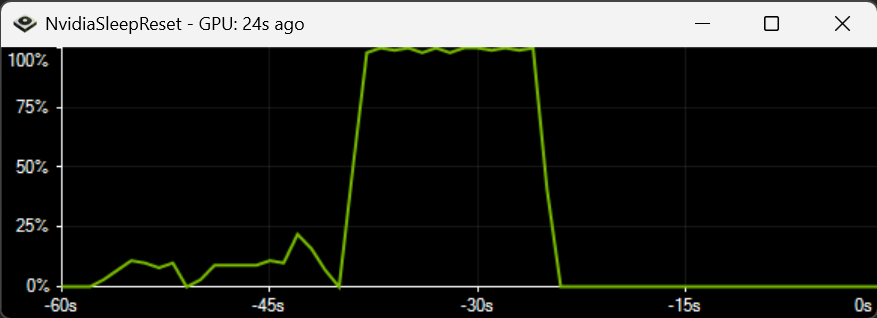

# NvidiaSleepReset

A Windows tool that prevents system sleep during NVIDIA GPU activity and resets the system's sleep timer when the GPU becomes idle, aligning with the power plan's timeout settings.

## Features

- Real-time monitoring of NVIDIA GPU usage using nvidia-smi
- Prevents system sleep when GPU is active
- Automatically adapts to system power settings for idle timeout
- Displays last GPU activity time in the window title
- Graphical representation of GPU usage over time

## Requirements

- Windows operating system
- NVIDIA GPU
- .NET Framework 4.7.2 or later

## Installation

1. Download the latest release from the [Releases](https://github.com/realies/NvidiaSleepReset/releases) page.
2. Run NvidiaSleepReset.exe.

## Usage

Simply run the application, and it will start monitoring your GPU usage. The window title will show the last GPU activity time, and the graph will display recent GPU usage.

## Building from Source

1. Clone the repository: `git clone https://github.com/realies/NvidiaSleepReset.git`
2. Open the solution in Visual Studio.
3. Build the solution (Ctrl+Shift+B).
4. Run the application (F5).
